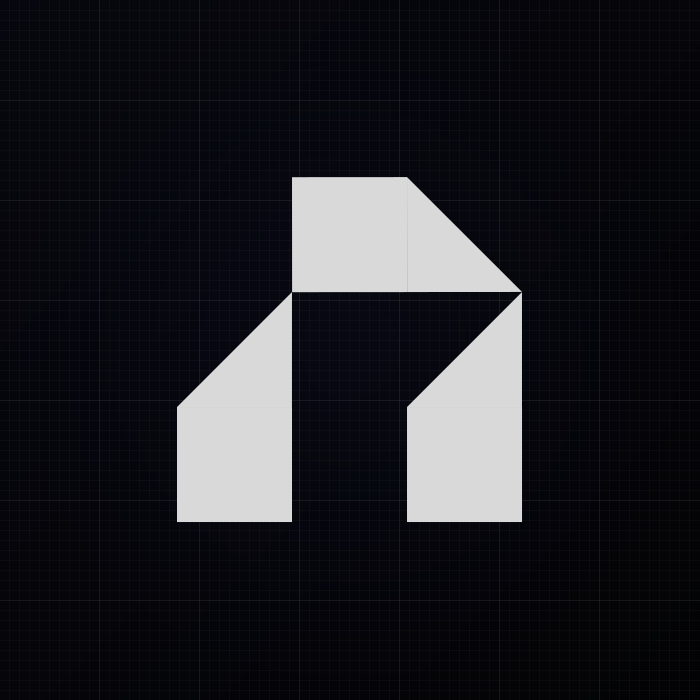

<!-- Head -->

<!-- Hero -->

<strong>A modern TypeScript CLI framework that makes building command-line applications simple and enjoyable.</strong>

  <!-- NPM page -->
  
  <!-- GitHub Repository -->
  
  <!-- License -->
  

